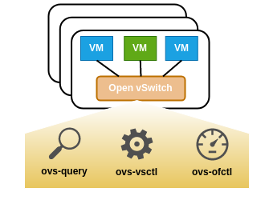

### **功能概述**

net模块目前集成如下功能：

- Open vSwitch管理
- Linux Briget

#### Open vSwitch管理 (ovs)

集成虚拟机交换机功能，可在系统上搭建ovs网络环境，并对其功能进行相关定制．

目前支持ovs-vsctl，ovs-query，ovs-ofctl能力．

	

openvswitch官网：https://www.openvswitch.org/

##### ovs-vsctl（ovs网络设置）

| 接口                             | 接口说明                   |
| -------------------------------- | -------------------------- |
| ovs-vsctl-add-br                 | 添加ovs网桥                |
| ovs-vsctl-del-br                 | 删除ovs网桥                |
| ovs-vsctl-add-port               | 网桥中添加端口             |
| ovs-vsctl-del-port               | 网桥中删除端口             |
| ovs-vsctl-set-netflow-rule       | 网桥中设置netflow 规则     |
| ovs-vsctl-del-netflow-rule       | 网桥中删除netflow 规则     |
| ovs-vsctl-set-ipfix-rule         | 网桥中设置ipfix 规则       |
| ovs-vsctl-del-ipfix-rule         | 网桥中删除ipfix 规则       |
| ovs-vsctl-set-port-vlan          | 设置ovs port vlanID        |
| ovs-vsctl-set-port-patch         | 设置ovs网桥间的连接patch口 |
| ovs-vsctl-set-port-bond          | ovs网桥添加bond接口        |
| ovs-vsctl-set-interface-policing | 设置接口限流policing       |
| ovs-vsctl-set-port-qos           | 设置port qos策略           |

##### ovs-query（ovs网络设备查询）

网桥信息查询接口，通过unix套接字调用ovsdb Json RPC接口管理ovs网桥. ovsdb Json RPC文档参考 RFC7047

接口列表：

| 接口                 | 接口说明                |
| -------------------- | ----------------------- |
| ovs-query-connection | 查询ovsdb连接状态       |
| ovs-query-bridges    | 查询ovs网桥接本信息     |
| ovs-query-ports      | 查询ovs port 信息       |
| ovs-query-interfaces | 查询ovs interface信息   |
| ovs-query-netflows   | 查询ovs netflow设置信息 |
| ovs-query-ipfix      | 查询ovs ipfix设置信息   |

##### ovs-oftcl（ovs网络流控设置）

ovs-ofctl：流控能力，调用 ovs-ofctl 命令执行

接口列表：

| 接口                       | 接口说明                               |
| -------------------------- | -------------------------------------- |
| ovs-ofctl-add-default-rule | 为网桥设置默认流表规则，二层交换机能力 |
| ovs-ofctl-clear-port-rules | 删除虚拟机网络接口的流表规则           |
| ovs-ofctl-forbid-dstip     | 禁止虚拟机访问外部IP                   |
| ovs-ofctl-forbid-dstport   | 禁止虚拟机访问外部端口                 |
| ovs-ofctl-pass-dstip       | 放通访问外部Ip地址，白名单能力         |
| ovs-ofctl-pass-dstport     | 放通访问外部Ip地址的某端口，白名单能力 |
| ovs-ofctl-mod-vlan         | 设置vlan id转换                        |

#### Linux Bridge管理

传统linux网桥管理，通过brctl命令实现对其常规功能的管理能力．相关功能接口如下：

| 接口                | 接口说明                |
| ------------------- | ----------------------- |
| brctl-add-br        | 添加linux网桥           |
| brctl-del-br        | 删除linux网桥           |
| brctl-add-interface | linux网桥中增加网络接口 |
| brctl-del-interface | linux网桥中删除网络接口 |
| brctl-stp-on        | 开启stp                 |
| brctl-stp-off       | 关闭stp                 |

