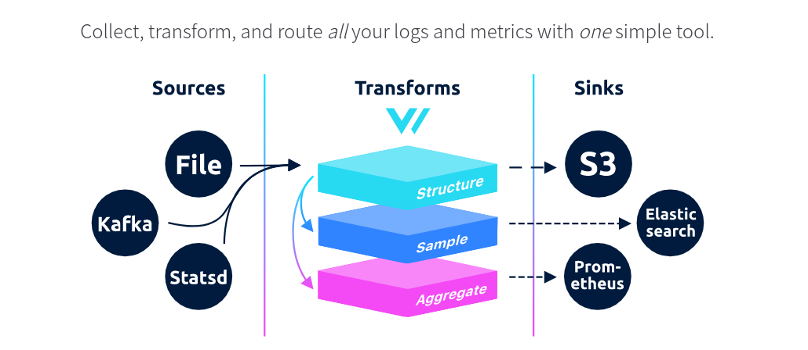

# Vector 

- Sources collect or receive data from observability data sources into Vector
- Transforms manipulate or change that observability data as it passes through your topology
- Sinks send data onwards from Vector to external services or destinations

Sources:

- syslog

Transforms:

Sinks:

View:
- Grafana

Vector 

