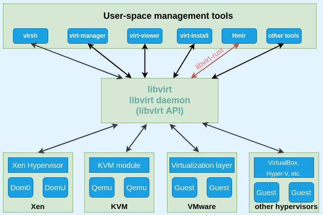

#### 功能概述

通过集成libvirt-rust，实现查询Hypervisor信息以及控制虚拟机相关操作的能力.

#### 相关原理说明：

libvirt结构图如下所示：

libvirt是目前使用最为广泛的针对KVM虚拟机进行管理的工具和API。Libvirtd是一个daemon进程，可以被本地和远程的virsh(命令行工具)调用，Libvirtd通过调用qemu-kvm操作管理虚拟机。libvirt 由应用程序编程接口 (API) 库、一个守护进程 (libvirtd)，和默认命令行实用工具 (virsh)等部分组成。Hmir项目中通过集成libvirt-rust中提供的rust接口，实现对Hypervisor的管理和控制。

官方文档说明：

- https://libvirt.org/html/index.html

- https://docs.rs/crate/virt/

  

#### 接口列表：

| 接口                      | 接口说明                    |
| ------------------------- | --------------------------- |
| virt-check-connection     | 检查hypervisor连接状态      |
| virt-show-hypervisor      | 显示hypervisor信息          |
| virt-show-libvirt-version | 显示libvirt版本信息         |
| virt-show-domains         | 显示已创建的所有 domain信息 |
| virt-show-nwfilters       | 显示设置的nwfilter信息      |
| virt-show-arch-models     | 显示cpu架构支持的models     |
| virt-show-networks        | 显示virt 网络信息           |
| virt-show-interfaces      | 显示virt网络接口信息        |
| virt-show-secrets         | 显示加密管理信息            |
| virt-show-storagepools    | 显示存储池信息              |
| virt-show-nodedevs        | 显示节点所有设备名称        |

#### 约束：

请确认环境上已安装libvirt-dev 或者libvirt-devel
